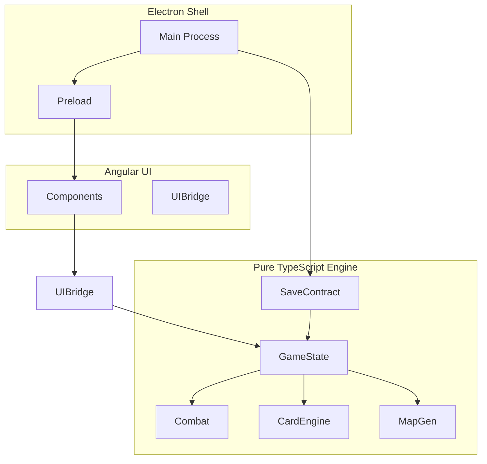

# Full Plan: Slay-the-Spire–like Game (Angular + Electron)

## Architecture (non-negotiable for scalability)

Keep the **three-layer split** from your chat so the engine never depends on Angular or Electron:

- **Electron**: window, menus, file system (saves), Steamworks (later). No game logic.
- **Angular**: screens, inputs, rendering of state (or delegating to PixiJS canvas). Calls into engine via a single bridge service; only passes serializable commands/state.
- **Engine**: pure TypeScript under e.g. `src/engine/`. No imports from `@angular/`* or `electron`. Receives “commands” (e.g. `playCard(cardId, targetIndex)`), mutates `GameState`, returns new state or events for the UI to reflect.

Data flow: **UI → command → Engine → new GameState / events → UI**. Saves are a serialized snapshot of `GameState` (and meta progression) to JSON via Electron.

---

## Decisions (locked in)

| Decision               | Choice                                                                                                                               |
| ---------------------- | ------------------------------------------------------------------------------------------------------------------------------------ |
| **Project location**   | `C:\Users\frana\Projects\slay-the-spire-like`                                                                                        |
| **PixiJS**             | Use from Phase 1 so combat/cards are rendered in PixiJS from the start (scalable for future visuals).                                |
| **Steam**              | In Phase 1 only scaffold Electron + Steam (init Steam in main, expose to preload); full Steamworks (achievements, build) in Phase 5. |
| **V1 scope (Phase 1)** | Exactly 10 cards, 1 enemy type. Minimal first playable slice.                                                                        |
| **Initial deck (V1)**  | 5 Strike, 4 Defend, 1 Bash.                                                                                                          |
| **Hand and draw**      | Start with 5 cards in hand; at end turn discard all hand, draw 5 card each turn (turn-based draw from Phase 1).                      |
| **Placeholder art**    | Simple PixiJS shapes/colors only at the start (no sprites/assets until later).                                                       |
| **Steam not running**  | Development: show warning but app still works. Production: app will NOT run without Steam.                                           |

---

## Phase 0: Project foundation and boundaries

**Goal:** Repo and app run with Electron + Angular, engine folder exists and is testable in isolation; one trivial “game” screen that reads from engine state.

### Steps

1. **Create repo and root tooling**
  - Project root: `**C:\Users\frana\Projects\slay-the-spire-like`**. `npm init`, TypeScript at root for engine, strict mode.
  - Add scripts: `build:engine`, `test:engine`, `start:ng`, `start:electron`, `build:electron`.
2. **Electron shell**
  - Add `electron` and `electron-builder`. Main process: create window, load Angular app (dev: `http://localhost:4200`, prod: `file://.../dist/...`).
  - Preload: expose a small API to renderer (e.g. `getAppPath()`, `readSave(path)`, `writeSave(path, data)`). No game logic in preload.
3. **Angular app**
  - New Angular app inside repo (e.g. `src/app/` or `projects/game-ui/`). Routing: `''` → Game, later `menu`, `settings`, etc.
  - Single “bridge” service (e.g. `GameBridgeService`) that:
    - Holds a reference to the engine’s `GameState` (or a facade).
    - Exposes methods like `startRun()`, `playCard(cardId, target?)`, `endTurn()`, `getState()`.
    - Only depends on engine types and functions (engine is in a path like `src/engine` or `libs/engine`).
4. **Engine skeleton**
  - Folder: `src/engine/` (or `libs/engine`). Its `tsconfig` has no Angular/Electron deps.
  - Minimal `GameState`: e.g. `playerHp`, `currentEncounter`, `phase: 'player' | 'enemy'`.
  - Minimal `runGame.ts`: `createInitialState()`, `playCard(state, cardId, target)`, `endTurn(state)` that return new state (immutable updates preferred).
  - Unit test: e.g. “playCard reduces enemy HP” without starting Angular or Electron.
5. **First UI binding**
  - One Angular component (e.g. `GameScreen`) that injects `GameBridgeService`, calls `getState()` and displays: player HP, one enemy HP, current phase. Buttons: “Play card” (hardcoded one card), “End turn”. Clicks call bridge → engine → state update → UI re-renders.
  - Ensures: UI is dumb; all rules live in engine.

**Deliverable:** App runs in Electron, one screen, one hardcoded card that does damage; engine testable with Node/Vitest/Jest.

**Scalability:** All new features (cards, relics, map) will live in engine + data; UI only displays and sends commands.

---

## Phase 1: Minimal combat loop (single encounter, no map)

**Goal:** Full turn-based combat: draw hand, play cards (energy), enemy intent and attack, win/lose. Cards and enemies are data-driven. **PixiJS** used from this phase for combat/card rendering. **Steam** scaffold only (init in main, no achievements yet). **V1 scope:** exactly **10 cards**, **1 enemy type**.

### Steps

1. **Steam scaffold (Phase 1 only)**
  - In Electron main: integrate Steamworks (e.g. `steamworks.js` or native SDK). On launch: init Steam; get Steam ID if running under Steam; expose to preload (e.g. `isSteamRunning()`, `getSteamId()`). No achievements or store yet—just wiring so Phase 5 only adds features. **Behavior:** if Steam is not running, show a warning (e.g. dialog or banner) but the app still runs in development; in production build, the app must NOT run without Steam (exit or block launch).
2. **PixiJS view layer**
  - Add PixiJS to the Angular app. One Angular component (e.g. `CombatCanvasComponent`) hosts a canvas; receives `GameState` from `GameBridgeService`; draws player area, hand (cards), enemies, energy, HP, intents using **simple PixiJS shapes/colors only** (rectangles, circles, text—no sprites or asset images at the start). Input: card click and "End turn" still call bridge → engine. No game logic in PixiJS—only rendering from state.
3. **Engine: combat state**
  - Extend `GameState`: `deck: string[]` (card IDs), `hand: string[]`, `discard: string[]`, `energy: number`, `maxEnergy: number`, `turnNumber`, `enemies: EnemyState[]` (id, hp, maxHp, block, intents).
  - `EnemyState` and intents: e.g. `{ type: 'attack', value: 8 }`. No UI types in engine.
4. **Card data (JSON)**
  - `data/cards.json`: array of `{ id, name, cost, effects: [{ type, value, target? }] }`. Effects: `damage`, `block`, `heal` (later: `draw`, `vulnerable`, etc.). **V1:** exactly **10 cards**.
  - Engine: `loadCards(data): Map<string, CardDef>`. All resolution by `id`.
5. **Effect engine**
  - `engine/effects/effectRunner.ts`: given `CardDef`, `GameState`, `target` (enemy index or 'player'), apply each effect in order; return new state. Pure functions.
  - `damage`: reduce enemy HP (consider block), clamp to 0. `block`: add to player block. `heal`: add to playerHp, cap at maxHp.
6. **Combat flow**
  - **Initial deck (V1):** 5 Strike, 4 Defend, 1 Bash. **Hand:** start combat with 5 cards in hand; **draw:** draw 1 card at the start of each player turn (turn-based). Shuffle discard into deck when deck is empty and a draw is required.
  - `startCombat(state, encounterId)`: load encounter from `data/encounters.json`, set initial hand to 5 cards (from deck), set energy, set enemy intents.
  - `playCard(state, cardId, target?)`: check cost, remove from hand, apply effects, add to discard. Return new state.
  - `endTurn(state)`: resolve enemy intents (apply damage to player, considering block), clear block; next turn: draw 1 card, refill energy, recalc intents. If all enemies dead → combat win; if player dead → combat lose.
7. **Enemy intents**
  - `data/enemies.json`: per enemy `id`, `name`, `maxHp`, `intents: [{ weight, intent: { type, value } }]`. Engine picks intent each turn (e.g. weighted random). Display string: "Attacking 8" etc. **V1:** exactly **1 enemy type** in this file.
8. **Angular + PixiJS UI**
  - Combat view in PixiJS: hand as clickable cards, energy, block, player HP, enemy list (HP, block, intent). Card click → select target if needed → `playCard(id, target)`. "End turn" button (can be DOM overlay or PixiJS). On win/lose, show message and "Restart".

**Deliverable:** One encounter type, **exactly 10 cards**, **1 enemy type**, full turn loop and win/lose. Combat rendered in PixiJS. Steam scaffold in place (init only). No deck building between fights yet.

**Scalability:** New cards = new JSON entries; new effects = new cases in effect runner. No hardcoded card logic in UI.

---

## Phase 2: Deck, map, and run structure

**Goal:** A “run” = map of nodes → choose path → fight at each node → rewards (card choice) → next node until boss or death. Deck persists across combats.

### Steps

1. **Run state in engine**
  - `GameState`: add `map: MapState`, `currentNodeId: string`, `deck: string[]` (card IDs), `gold`, `relics: string[]` (placeholder), `floor: number`.
  - `MapState`: `nodes: { id, type: 'combat'|'elite'|'rest'|'shop'|'event'|'boss' }`, `edges: [fromId, toId]`. One path: linear or a few branches.
2. **Map generation**
  - `engine/map/mapGenerator.ts`: `generateMap(seed?, actConfig)` → `MapState`. Act config: e.g. 5–7 combats, 1–2 rest, 1 shop, 1 boss. Assign node types; connect in sequence (or simple branching). Deterministic if seed used.
3. **Run lifecycle**
  - `startRun(seed?)`: create initial deck (e.g. 10 strikes, 5 defends), generate map, set currentNode = first node, set phase to map.
  - `chooseNode(state, nodeId)`: validate it’s adjacent, set current node, then:
    - Combat/elite → `startCombat(state, encounterId)`.
    - Rest → heal (e.g. 30% max HP), remove one card (optional), then back to map.
    - Shop → open shop (Phase 3).
    - Event → random event (Phase 3).
    - Boss → start boss combat; on win, “Act complete” (Phase 4).
4. **Post-combat rewards**
  - After combat win: `getReward(state)`: gold + 3 card choices. `chooseCardReward(state, cardId)`: add card to deck, then advance to map and show next nodes.
5. **Data**
  - `data/encounters.json`: by act/floor or pool, list of encounter definitions (enemy IDs). `data/mapConfig.json`: node counts per type per act.
6. **Angular UI**
  - Map screen: nodes as boxes, edges as lines; current node highlighted; click adjacent node to move. After combat, show reward screen (3 cards), then return to map.
  - Rest site: buttons “Heal”, “Remove card” (list to choose), then back to map.

**Deliverable:** One act: map with combat/rest/boss nodes; deck grows via rewards; run ends at boss win or player death.

**Scalability:** Multiple acts = different `mapConfig` and encounter pools; map algorithm stays the same.

---

## Phase 3: Relics, shops, events

**Goal:** Relics modify rules (e.g. +1 energy, +1 draw); shops to buy cards/relics; simple events with choices.

### Steps

1. **Relics (data + engine)**
  - `data/relics.json`: `{ id, name, description, triggers: [{ when, effect }] }`. Triggers: “onTurnStart”, “onCombatStart”, “onCardPlay”, “passive” (e.g. maxHp +5).
  - Engine: `relicRunner.ts` similar to effect runner: when phase/event happens, run applicable relics, return new state. Relics only change state (no UI).
2. **Shop**
  - `data/shopPools.json`: card and relic pools by act. At shop node: generate 6–10 cards, 3 relics, prices. `purchaseCard(state, cardId)`, `purchaseRelic(state, relicId)` (spend gold, add to deck/relics).
3. **Events**
  - `data/events.json`: `{ id, text, choices: [{ text, outcome: { type, payload } }] }`. Outcomes: “addCard”, “loseCard”, “heal”, “gold”, “curse”, “obtainRelic”, “fight”, “nothing”.
  - Engine: `executeEventChoice(state, eventId, choiceIndex)` → apply outcome, return new state. One event per event node (random from pool).
4. **UI**
  - Shop screen: grid of cards/relics with prices; gold display; buy button. Relics screen (inventory) in run header or separate panel.
  - Event screen: text + choice buttons; on choice, run outcome and show result, then back to map.

**Deliverable:** Relics affect combat and run; shops and events are part of the run and persist in state.

**Scalability:** New relics/events = JSON + small engine hooks; no UI logic for “what does this relic do”.

---

## Phase 4: Multiple acts, bosses, meta progression

**Goal:** 2–3 acts with different encounters and a boss per act; optional meta progression (unlocks) stored separately from run.

### Steps

1. **Act structure**
  - `GameState`: `act: number`, `mapConfig` per act. After boss kill, `act++`, generate next map, set first node. Win condition: beat final act boss.
2. **Bosses**
  - Boss = special encounter (one enemy, big HP, multi-phase if desired). `data/bosses.json` with encounter ID; same combat system, different intents and stats.
3. **Meta progression (optional)**
  - Separate save: `meta.json`: `{ unlockedCards: string[], unlockedRelics: string[], highestActReached }`. On run start, deck/relic pools filter by unlocked. Unlock rules: e.g. “win with Ironclad” → unlock card X. Engine has `loadMeta()`, `unlockCard(id)`, etc.; Electron reads/writes `meta.json`.
4. **Balance and content**
  - Tune numbers (damage, HP, gold) per act. Add more cards, relics, events so runs feel varied.

**Deliverable:** Full run across acts with bosses; optional unlocks; run save and meta save both in JSON.

**Scalability:** New acts = new config and content; meta system supports new unlock types without changing core loop.

---

## Phase 5: Save/load and Steam (Electron + Steamworks)

**Goal:** Save run to JSON; load on launch; Steam build with achievements (and optional overlay).

### Steps

1. **Save format**
  - Single run: serialize `GameState` (deck, map, HP, relics, gold, current node, etc.) to JSON. Version field for future migrations. Meta in separate file.
2. **Electron save API**
  - Preload: `writeSave('run.json', data)`, `readSave('run.json')`, `writeSave('meta.json', data)`. Main process uses `fs` and user data path (e.g. `app.getPath('userData')`).
3. **Save/load flow**
  - On “Quit” or “Main menu”: if run in progress, write state to `run.json`. On launch: Angular asks for run; if exists, offer “Continue” / “New run”. Load = parse JSON → rebuild `GameState` in engine (validate schema/version).
4. **Steamworks SDK**
  - Integrate Steamworks SDK in Electron main process (native module or `steamworks.js`). On launch: init Steam; get Steam ID if needed for cloud path (optional). Do not put game logic in Steam code.
5. **Achievements**
  - Define achievement IDs in Steamworks backend. Engine or bridge: when condition met (e.g. “boss_kill”, “first_win”), call exposed method `reportAchievement(id)`. Preload exposes this to Angular; Angular calls after engine signals.
6. **Build for Steam**
  - electron-builder: Steam target, depot IDs, app ID. Test with Steam client in dev mode. Ensure only one instance (Steam single instance).

**Deliverable:** Persistent run and meta; Steam build; achievements fire from in-game actions.

**Scalability:** More achievements = new IDs and one “report” call per; save format versioning allows schema evolution.

---

## Phase 6: Polish and optional PixiJS

**Goal:** Juice (animations, feedback), optional PixiJS for combat/cards, and performance.

### Steps

1. **PixiJS (optional)**
  - If you add PixiJS: use it only in Angular as a “view” layer. Engine still owns state. Angular component hosts canvas; receives state from bridge; draws board, cards, enemies from state. Input (card click, end turn) still goes bridge → engine. No game logic inside PixiJS.
2. **Animations**
  - Card play: short tween (move to target, damage number). Enemy attack: shake or flash. Use Angular animations or PixiJS tweens, driven by state changes from engine.
3. **Audio**
  - Sound effects (card play, hit, win, lose) and music. Engine can emit “event” types (e.g. `cardPlayed`, `enemyDied`); UI subscribes and plays sounds. No audio logic in engine.
4. **Performance**
  - If hand is large or map is big: virtualize lists in Angular; in PixiJS use object pooling for card sprites. Keep engine tick-free; only update on user action or after async “enemy turn” delay.
5. **Settings**
  - Volume, fullscreen, language (if you add i18n). Stored in JSON or localStorage; applied in UI only.

**Deliverable:** Game feels responsive and clear; optional PixiJS for richer visuals; no regression in architecture.

---

## Summary: what keeps it scalable

| Concern                      | Approach                                                                        |
| ---------------------------- | ------------------------------------------------------------------------------- |
| New cards                    | Add to `cards.json` + effect types in effect runner; no UI code.                |
| New relics                   | Add to `relics.json` + trigger in relic runner.                                 |
| New acts                     | New map config + encounter pools; same map generator.                           |
| New content (events, bosses) | JSON + small engine hooks.                                                      |
| UI vs logic                  | Engine is pure TS; UI only displays and sends commands.                         |
| Saves                        | Single serialization of `GameState` + meta; version field for migrations.       |
| Steam                        | Confined to Electron main + preload; achievements triggered from engine events. |

---

## Further questions (optional)

All previously listed items are now decided and recorded in **Decisions (locked in)** and in the Phase 1 steps above. Any new scope or behavior questions can be added here during implementation.